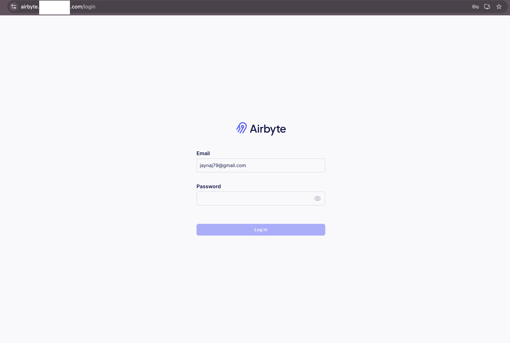
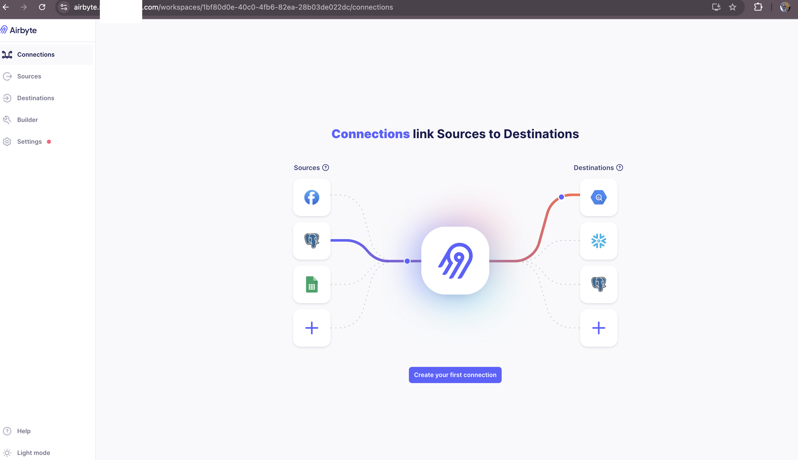

# Airbyte on Kubernetes (Production-Grade Terraform Deployment)

> A hardened Airbyte deployment on a Hetzner-hosted Kubernetes cluster using Terraform + Helm. Built for real-world ELT pipelines with externalized services, persistent storage, and secure credential management.

---

## 🧠 Overview

This project provisions an **Airbyte data integration platform** on a Hetzner-managed Kubernetes cluster using `helm_release` inside Terraform. Rather than relying on default values.yaml, all configurations are passed as **inline dynamic values**, enabling tighter control over environments and integrations.

---

## ⚙️ Key Features

| Feature                       | Description                                                                      |
| ----------------------------- | -------------------------------------------------------------------------------- |
| 🔐 External PostgreSQL        | Airbyte connects to a pre-provisioned PostgreSQL instance via Kubernetes secrets |
| 💾 External S3 Storage        | Persistent storage routed through S3 with access keys securely managed           |
| 📦 Helm via Terraform         | Declarative, repeatable infra—Airbyte managed fully via `helm_release` resource  |
| 🧼 Embedded Services Disabled | Keycloak, internal Minio, and internal PostgreSQL disabled for better modularity |
| 🔐 Auth Configured            | Admin credentials injected via secrets and Terraform                             |
| 🌐 Ingress Disabled           | Managed separately via central NGINX ingress + cert-manager setup                |

---

## 📁 Project Structure

airbyte-k8s/
├── airbyte.tf # Helm release config with dynamic values
├── ingress.tf # Central ingress resource for Airbyte web UI
├── main.tf # Terraform entrypoint
├── providers.tf # Kubernetes & Helm provider blocks
├── secrets.tf # Sensitive credentials injected as Kubernetes secrets
├── variables.tf # Parameter definitions for modular deployment

---

## 🌐 Access Model

Ingress is **not managed inside the chart**. Instead:

- Centralized NGINX ingress controller handles routing
- TLS certificates issued via Let’s Encrypt + cert-manager
- Airbyte exposed through subdomain: `airbyte.example.com` (via `${var.ingress_host}`)

---

## 🔒 Security Architecture

- Secrets are created using `kubernetes_secret` with namespaced access
- S3 and Postgres credentials are never hardcoded—always referenced from secrets
- Helm values for auth use:
  - `emailSecretKey`
  - `passwordSecretKey`
  - Mapped to secret keys created outside the Helm release

---

## 🧠 Design Decisions

| Decision            | Rationale                                                              |
| ------------------- | ---------------------------------------------------------------------- |
| External PostgreSQL | Avoids reliance on in-cluster DBs; improves portability and resilience |
| Disable Keycloak    | Simplifies auth; handled via injected secrets for now                  |
| Disable Minio       | S3-compatible storage already exists (via Hetzner)                     |
| Inline Helm Values  | Keeps config tightly coupled to Terraform state and variables          |
| Central Ingress     | Ensures clean routing and avoids redundant ingress definitions         |

---

## 🛠️ Deployment Steps

1. Define your variable values in `terraform.tfvars` (or use a backend)
2. Create necessary secrets via `kubernetes_secret` resource
3. Run Terraform:
   ```bash
       terraform init
       terraform apply
   ```

---

## 🌐 Access Model

Airbyte will be deployed into the `${var.airbyte_namespace}` namespace, reachable via `${var.ingress_host}`.

Ingress is **not managed by the Helm chart**.  
Instead, it's handled via a centralized NGINX ingress controller with TLS certificates issued by cert-manager and Let’s Encrypt.

---

## 🧩 Example Use Case

This Airbyte deployment is part of a **fintech pipeline project**:

- Extracts data from internal APIs & third-party tools
- Loads into PostgreSQL and external S3 buckets
- Monitored via separate Prometheus + Grafana stack

> **Future iterations** will integrate DBT and Apache Airflow for full ELT orchestration.

---

## 📸 Screenshots

### 🔹 Grafana Dashboard



### 🔹 Loki Logs UI



---

## 🧠 Lessons Learned

- Not all charts are ready for prod out-of-the-box — had to override core components for modularity
- Disabling embedded ingress and managing externally gave more control over routing and TLS
- Mapping secrets cleanly into inline Helm values requires attention to Terraform variable encoding and structure

---

## 🧱 Next Improvements

- Integrate service monitors and exporters for Airbyte via Prometheus
- Add automated sync workflows via Airbyte API or scheduler
- Create Helm values files as fallbacks for manual debug deploys

---

## ✍🏾 Author

**Juliet “Jade” Adjei**  
DevOps Engineer | Infrastructure Integrator | Builder of Real Systems  
📧 [jaynaj79@gmail.com](mailto:jaynaj79@gmail.com)  
🔗 [LinkedIn](https://linkedin.com/in/juliet-adjei-559048b3)

---

## 🔗 Part of the Bigger Picture

This project is part of my broader DevOps portfolio:  
👉 [jade-devops-portfolio](https://github.com/Jadebat79/jade-devops-portfolio)

Explore real deployments, real configs, and lessons earned in production.
